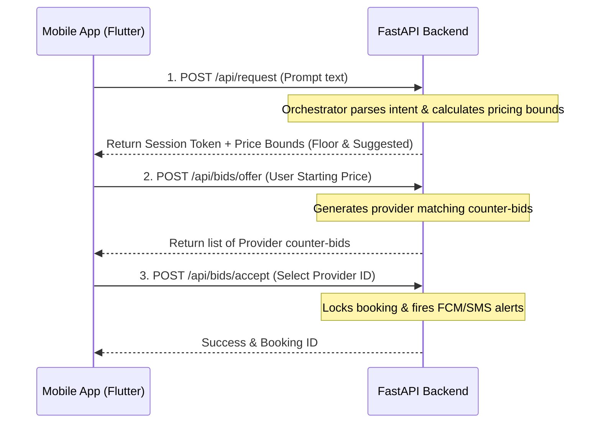

# Frontend-Backend Integration Plan: FikrFree 📱↔️💻

This guide provides the Flutter/Frontend team with a step-by-step technical plan to connect the mobile application to the FastAPI backend services.

---

## 🌐 1. Base Configuration & Environments
To connect your mobile app, define your target endpoints based on the running environment:

| Platform | Target Address | WebSocket Protocol |
| :--- | :--- | :--- |
| **Android Emulator** | `http://10.0.2.2:8000` | `ws://10.0.2.2:8000` |
| **iOS Simulator** | `http://localhost:8000` | `ws://localhost:8000` |
| **Physical Mobile Device** | `http://<YOUR_LOCAL_IP>:8000` | `ws://<YOUR_LOCAL_IP>:8000` |

> [!IMPORTANT]
> Make sure both the laptop running uvicorn and your physical test phone are on the exact same Wi-Fi connection.

---

## 🔑 2. Secure Token Storage & Headers
All requests must store and send security tokens. Use `flutter_secure_storage` to persist tokens locally.

### Header Conventions:
* **User Authentication**: Attach `Authorization: Bearer <jwt_token>` for access.
* **Bidding Isolation (Session Token)**: Attach `X-Session-Token: <session_token>` returned by `/api/request` to protect negotiation calls.

```dart
// Example using Dio package:
final dio = Dio(BaseOptions(
  baseUrl: 'http://10.0.2.2:8000',
  headers: {
    'Authorization': 'Bearer $userJwtToken',
    'X-Session-Token': '$activeSessionToken',
  },
));
```

---

## 🛠️ 3. Interactive Bidding Integration Loop
Follow this sequence to execute the InDrive-style negotiation:



### Steps:
1. **Initiate Request**: Post the user's Roman Urdu request to `/api/request`. Save the returned `session_token` and show the `suggested_price` and `floor_price` bounds in the UI.
2. **Submit Starting Offer**: Send the chosen starting offer inside the pricing boundaries to `/api/bids/offer`. State management should wait for counter-offers returned in the response list.
3. **Accept Provider Bid**: Send the accepted price and provider ID to `/api/bids/accept` to finalize and lock the task.

---

## 💬 4. In-App Chat WebSocket Connection
Once a booking is finalized, open a persistent WebSocket channel for chat:

### Establish Connection:
```dart
import 'package:web_socket_channel/io.dart';

final channel = IOWebSocketChannel.connect(
  Uri.parse('ws://10.0.2.2:8000/ws/chat/$bookingId/$userId'),
);
```

### Protocol Payload (JSON):
* **Outgoing Messages**: Send messages using the following JSON schema:
  ```json
  {
    "sender_id": "usr_789",
    "text": "Assalam-o-Alaikum, mein pohnch gya hoon."
  }
  ```
* **Incoming Broadcasts**: Listen to the channel stream and parse incoming JSON payload blocks into UI chat message widgets.

---

## 🔔 5. Push Notification Setup (FCM)
Keep the provider and customer updated on background events:

1. **Get FCM Token**: Retrieve the token using the `firebase_messaging` Flutter SDK:
   ```dart
   String? token = await FirebaseMessaging.instance.getToken();
   ```
2. **Register Token with Backend**: Send the token to `/api/notification/register-device-token`:
   ```json
   {
     "user_id": "prov_123",
     "token": "fcm_token_string_here"
   }
   ```
3. **Handle Background Actions**: When a push arrives (e.g. type `job_assigned`), navigate the user/provider directly to the active chat or booking screen.
